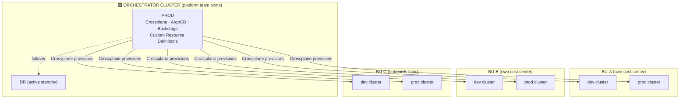
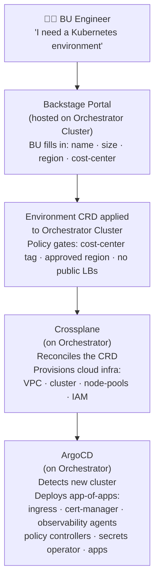

# Cluster Topology

## Orchestrator Cluster

A single **Orchestrator Cluster** (platform team owns, PROD + DR) runs Crossplane, ArgoCD, and Backstage. It holds no BU workloads — its sole job is to provision and manage infrastructure for every customer on demand via Custom Resource Definitions (CRDs).

| What the platform runs | Clusters | Cost model |
| ---------------------- | -------- | ---------- |
| Orchestrator (PROD + DR) | 2 | Flat platform cost — does not scale with BU count |
| Per-BU workloads | 2 per BU (dev + prod) | BU cost center |

---

## Orchestrator Components

| Component | Role |
| --------- | ---- |
| **Crossplane** | Reconciles CRDs into cloud infrastructure (VPCs, clusters, IAM, node pools) |
| **ArgoCD** | Detects newly provisioned clusters and deploys app-of-apps (ingress, cert-manager, observability agents, policy controllers, secrets operator, apps) |
| **Backstage** | Self-service portal — BU engineers submit environment requests that generate CRDs |

---

## How a BU Gets an Environment

**Principle: "CRDs declare intent · Crossplane provisions infra · ArgoCD delivers everything else"**

---

## DR Strategy

The Orchestrator Cluster runs in an active/standby configuration:

- **PROD** handles all live traffic — CRD reconciliation, GitOps sync, portal serving.
- **DR** is a hot standby, continuously synced. In the event of a PROD failure, failover is triggered and the DR instance takes over without re-provisioning BU clusters (workloads keep running independently).

> BU workload clusters are independent of the Orchestrator. A failure of the Orchestrator pauses new provisioning and deployments but does not affect running BU workloads.
