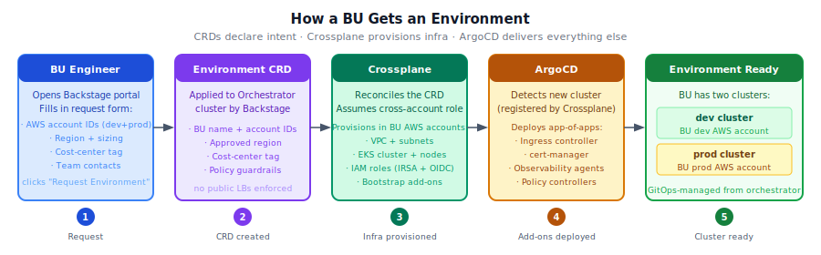
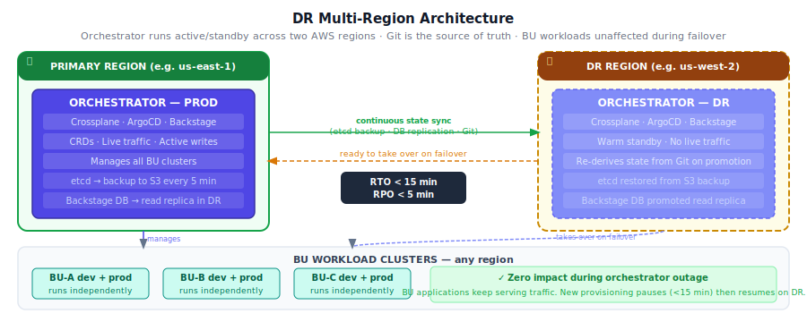
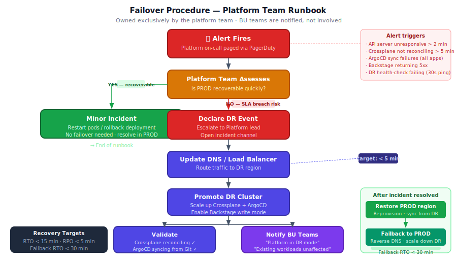

# Cluster Topology

## Orchestrator Cluster

A single **Orchestrator Cluster** (platform team owns, PROD + DR) runs Crossplane, ArgoCD, and Backstage. It holds no BU workloads — its sole job is to provision and manage infrastructure for every customer on demand via Custom Resource Definitions (CRDs).

| What the platform runs | Clusters | Cost model |
| ---------------------- | -------- | ---------- |
| Orchestrator (PROD + DR) | 2 | Flat platform cost — does not scale with BU count |
| Per-BU workloads | 2 per BU (dev + prod) | BU cost center |

---

## Orchestrator Components

| Component | Role |
| --------- | ---- |
| **Crossplane** | Reconciles CRDs into cloud infrastructure (VPCs, clusters, IAM, node pools) |
| **ArgoCD** | Detects newly provisioned clusters and deploys app-of-apps (ingress, cert-manager, observability agents, policy controllers, secrets operator, apps) |
| **Backstage** | Self-service portal — BU engineers submit environment requests that generate CRDs |

---

## How a BU Gets an Environment

**Principle: "CRDs declare intent · Crossplane provisions infra · ArgoCD delivers everything else"**

### What the BU Admin supplies

| Input | Detail |
| ----- | ------ |
| AWS Account ID (dev) | Crossplane assumes a cross-account IAM role into this account to build the dev environment |
| AWS Account ID (prod) | Crossplane assumes a cross-account IAM role into this account to build the prod environment |
| Region | Where both clusters are provisioned |
| Node sizing | Instance type + desired/min/max counts (defaults apply if omitted) |
| Cost-center tag | Applied to all AWS resources for billing attribution |
| Team contacts | Owner and on-call contacts registered in Backstage catalog |

### What Crossplane builds (per account)

| Resource | Detail |
| -------- | ------ |
| VPC | One isolated VPC per environment |
| Subnets | 1 public subnet (NAT GW + LB ENIs) · 2 private subnets (EKS worker nodes) |
| EKS Cluster | Self-managed node group · IMDSv2 enforced · EBS encryption enabled |
| IRSA + OIDC | Per-workload IAM roles mapped to Kubernetes service accounts |
| Bootstrap add-ons | ArgoCD agent · ESO · Cilium — installed at cluster creation time |

Once provisioning completes, the ArgoCD agent on the BU cluster registers it with the orchestrator's ArgoCD. From that point forward ArgoCD manages the cluster remotely and deploys the full app-of-apps (ingress, cert-manager, observability agents, policy controllers).

---

## DR Strategy

> **Owned and operated exclusively by the Platform team.** BU teams have no involvement in DR management — they are notified of status and experience no disruption to running workloads.

---

### Multi-Region Architecture

---

### What Gets Synced (Continuous Replication)

| Component | What is replicated | Mechanism |
| --------- | ------------------ | --------- |
| **Crossplane** | All Composite Resource Claims, provider configs, managed resource state | etcd backup + restore to DR; Crossplane re-adopts existing cloud resources on startup |
| **ArgoCD** | All Application and AppProject manifests, cluster registrations, RBAC | Git is the source of truth — DR ArgoCD re-syncs from the same Git repos on startup |
| **Backstage** | Service catalog, software templates, BU onboarding records | Database replication to DR region (read replica promoted on failover) |
| **Secrets** | All secrets remain in the cloud secret manager (e.g. AWS Secrets Manager) | Not stored on the cluster — DR reads from the same secret store |
| **CRD definitions** | All platform CRDs and composite resource definitions | Stored in Git — applied to DR cluster by ArgoCD bootstrap on startup |

> **Key principle:** Git is the ultimate source of truth. The DR cluster does not need to replicate in-memory state — it re-derives everything from Git and the cloud provider's own resource state.

---

### Failure Detection

The Platform team is responsible for monitoring Orchestrator health. Alerts fire on:

- Orchestrator API server unresponsive for > 2 minutes
- Crossplane controller not reconciling for > 5 minutes
- ArgoCD sync failures across all applications
- Backstage portal returning 5xx errors
- Cross-region health check (DR pings PROD every 30 seconds) failing

All alerts route to the **Platform team on-call** via PagerDuty (or equivalent). BU teams are never in the alert path for Orchestrator health.

---

### Failover Procedure (Platform Team Runbook)

---

### Recovery Targets

| Metric | Target | Notes |
| ------ | ------ | ----- |
| **RTO** (Recovery Time Objective) | < 15 minutes | Time from alert to DR cluster serving traffic |
| **RPO** (Recovery Point Objective) | < 5 minutes | Maximum data loss (last Git commit + secret manager state) |
| **Failback RTO** | < 30 minutes | Time to restore PROD and cut back from DR |

---

### Impact During DR Mode

| What | Impact |
| ---- | ------ |
| **Running BU workloads** | None — BU dev/prod clusters run independently. Outage of the Orchestrator does not affect live application traffic. |
| **New environment provisioning** | Paused during failover window (< 15 min), then restored on DR cluster |
| **GitOps deployments** | Brief pause during failover, then ArgoCD on DR re-syncs from Git automatically |
| **Backstage portal** | Unavailable during failover window, then restored on DR cluster |

---

### Platform Team Responsibilities

| Responsibility | Owner |
| -------------- | ----- |
| Monitor Orchestrator health 24/7 | Platform on-call rotation |
| Execute failover runbook | Platform team lead + on-call engineer |
| Communicate status to BU teams | Platform team lead |
| Maintain and test DR cluster monthly | Platform SRE |
| Conduct quarterly failover drills | Platform team |
| Restore PROD and execute failback | Platform SRE |
| Post-incident review | Platform team + management |
