# GitOps Promotion Flow

ArgoCD does not "move code." It continuously reconciles each cluster to whatever Git declares. **Promotion is a Git operation** — bump an image tag or Kustomize overlay in the prod path and ArgoCD reflects it.

```mermaid
flowchart LR
    PUSH["👩‍💻 Developer\n━━━━━━━━━━━━\nPushes code"]
    PR["GitHub PR\n━━━━━━━━━━━━\nReview → merge"]
    CI["CI Build\n━━━━━━━━━━━━\nImage built + signed\nSBOM generated\nPushed to JFrog"]
    DEV_GIT["Git update\n━━━━━━━━━━━━\nBump image tag\ndev overlay"]
    DEV_SYNC["ArgoCD\n━━━━━━━━━━━━\nReconciles\ndev cluster ✅"]
    PROMOTE["Promotion\n━━━━━━━━━━━━\nKargo pipeline\nor overlay bump"]
    PROD_GIT["Git update\n━━━━━━━━━━━━\nBump image tag\nprod overlay"]
    PROD_SYNC["ArgoCD\n━━━━━━━━━━━━\nReconciles\nprod cluster\ncanary / blue-green ✅"]

    PUSH --> PR --> CI --> DEV_GIT --> DEV_SYNC --> PROMOTE --> PROD_GIT --> PROD_SYNC

    style PUSH      fill:#1D4ED8,stroke:#1E3A8A,color:#FFFFFF,font-weight:bold
    style PR        fill:#1D4ED8,stroke:#1E3A8A,color:#FFFFFF
    style CI        fill:#7C3AED,stroke:#5B21B6,color:#FFFFFF
    style DEV_GIT   fill:#4F46E5,stroke:#3730A3,color:#FFFFFF
    style DEV_SYNC  fill:#0D9488,stroke:#0F766E,color:#FFFFFF
    style PROMOTE   fill:#D97706,stroke:#B45309,color:#FFFFFF,font-weight:bold
    style PROD_GIT  fill:#4F46E5,stroke:#3730A3,color:#FFFFFF
    style PROD_SYNC fill:#DC2626,stroke:#991B1B,color:#FFFFFF,font-weight:bold
```

---

## Stage Breakdown

| Stage | Tool | What happens |
| ----- | ---- | ------------ |
| **Push → PR → Merge** | GitHub | Developer raises a PR; peer review gates the merge |
| **CI Build** | GitHub Actions | Image built, signed with cosign, SBOM generated, pushed to JFrog Artifactory |
| **Dev Git update** | Kargo / automation | Image tag bumped in the dev Kustomize overlay |
| **Dev reconcile** | ArgoCD (on Orchestrator) | ArgoCD detects the Git change and syncs the dev cluster |
| **Promotion** | Kargo pipeline | Multi-stage pipeline promotes the validated image tag to the prod overlay |
| **Prod Git update** | Kargo / automation | Image tag bumped in the prod Kustomize overlay |
| **Prod reconcile** | ArgoCD + Argo Rollouts | ArgoCD syncs the prod cluster; Argo Rollouts executes canary or blue-green strategy |

---

## Key Principles

- **Git is the source of truth.** No direct kubectl applies to clusters — every change goes through Git.
- **Promotion is a Git operation.** Kargo or a manual overlay bump in the prod path triggers prod deployment. There is no "push to prod" button.
- **Supply-chain security is enforced at CI.** Images unsigned or without a valid SBOM are rejected by admission control at the cluster — they never reach prod.
- **Progressive delivery on prod.** Argo Rollouts manages canary or blue-green rollouts so bad releases are caught before full traffic shift.
