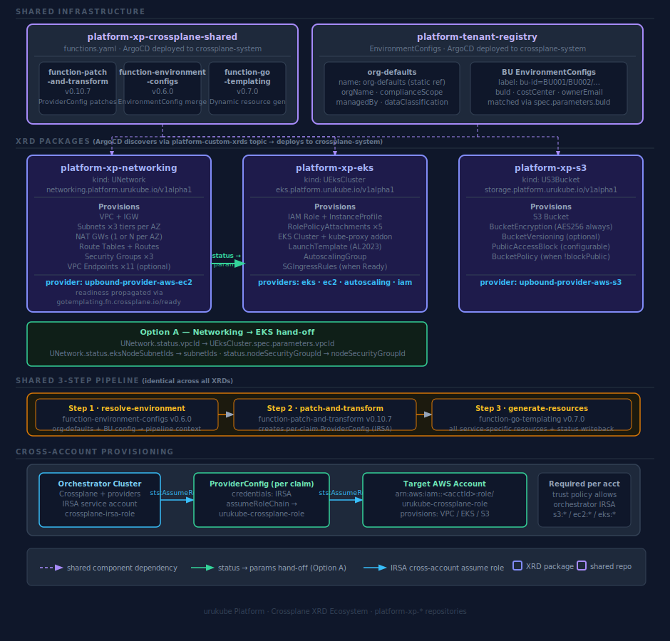

# urukube Platform — Crossplane XRD Ecosystem

This document describes the relationship between all `platform-xp-*` repositories and the shared infrastructure that powers them.

## Ecosystem overview



---

## What is Crossplane

Crossplane turns Kubernetes into a universal control plane for cloud infrastructure. Instead of running Terraform pipelines or clicking through AWS consoles, a developer submits a Kubernetes resource (a **claim**) and Crossplane continuously reconciles real cloud resources to match the desired state — the same way Kubernetes reconciles pods.

### Core concepts

| Concept | What it is | Analogy |
|---|---|---|
| **XRD** (Composite Resource Definition) | Defines the API — what fields a claim accepts, what it returns in status | Like a Kubernetes CRD schema |
| **Composition** | The implementation — maps a claim to one or more cloud resources via a pipeline | Like a Helm chart, but reconciled continuously |
| **Claim** | What a developer or BU submits (`UNetwork`, `UEksCluster`, `US3Bucket`) | Like a `Deployment` — the intent |
| **Composed resource** | A real cloud object managed by a provider (VPC, S3 bucket, EKS cluster) | The actual AWS resource |
| **Provider** | The driver that translates Crossplane resources into AWS API calls | Like a Kubernetes controller for a specific service |
| **EnvironmentConfig** | A cluster-side config object that injects org/BU metadata into compositions at claim time | Like ConfigMap, but scoped to the composition pipeline |

### How a claim becomes infrastructure

```
Developer submits claim (kubectl apply)
  │
  ▼
Crossplane XRD validates the spec
  │
  ▼
Composition pipeline runs (3 steps)
  ├─ Step 1: merge org-defaults + BU EnvironmentConfig → pipeline context
  ├─ Step 2: create per-claim ProviderConfig (IRSA cross-account credentials)
  └─ Step 3: render all AWS resources via Go templates → apply to target account
  │
  ▼
Providers reconcile each composed resource against AWS APIs
  │
  ▼
Status fields written back to claim (vpcId, clusterEndpoint, etc.)
```

The reconciliation loop runs continuously — if someone deletes a subnet in AWS directly, Crossplane detects the drift and recreates it within seconds.

### Why Crossplane over Terraform for self-service

| | Terraform | Crossplane |
|---|---|---|
| Execution model | Pipeline runs once per `apply` | Continuous reconciliation loop |
| Drift detection | Manual (`terraform plan`) | Automatic — every reconcile cycle |
| Multi-tenancy | Needs separate state per tenant | Native — each claim is isolated |
| Self-service by BUs | Needs CI wrapper + RBAC around state | Native Kubernetes RBAC on claim kinds |
| GitOps | Via external tooling | Native — composition lives in Git, ArgoCD deploys it |

---

## Repositories

### Shared infrastructure

| Repo | Role |
|---|---|
| [`platform-xp-crossplane-shared`](../platform-xp-crossplane-shared) | Pins the three shared Crossplane pipeline functions used by all XRDs. ArgoCD deploys `functions.yaml` to `crossplane-system` on the orchestrator cluster. |
| [`platform-tenant-registry`](../platform-tenant-registry) | Stores `org-defaults` (org-wide metadata) and per-BU `EnvironmentConfig` resources (buId, costCenter, ownerEmail). All XRDs merge these at claim time via Step 1. |

### XRD packages

Each repo defines one Crossplane XRD (Composite Resource Definition) and is auto-discovered by ArgoCD via the `platform-custom-xrds` GitHub topic.

| Repo | Claim kind | API group | What it provisions |
|---|---|---|---|
| [`platform-xp-networking`](../platform-xp-networking) | `UNetwork` | `networking.platform.urukube.io/v1alpha1` | VPC, subnets (3 tiers × N AZs), NAT GWs, route tables, security groups, VPC endpoints |
| [`platform-xp-eks`](../platform-xp-eks) | `UEksCluster` | `eks.platform.urukube.io/v1alpha1` | IAM node role, EKS cluster, kube-proxy addon, AL2023 LaunchTemplate, AutoscalingGroup |
| [`platform-xp-s3`](../platform-xp-s3) | `US3Bucket` | `storage.platform.urukube.io/v1alpha1` | S3 bucket, encryption, versioning, public access block, optional IP-allowlist bucket policy |

### Supporting repos

| Repo | Role |
|---|---|
| [`platform-xp-example-resources`](../platform-xp-example-resources) | Example claims for `UNetwork` and `US3Bucket` — useful as copy-paste starting points |
| [`orchestrator-custom-addons`](../orchestrator-custom-addons) | Provides the `provider-aws-irsa` `DeploymentRuntimeConfig` referenced by every provider install |

---

## Shared 3-step pipeline

All three XRDs use an identical composition pipeline structure:

```
Step 1 · resolve-environment   → function-environment-configs  v0.6.0
Step 2 · patch-and-transform   → function-patch-and-transform  v0.10.7
Step 3 · generate-resources    → function-go-templating         v0.7.0
```

**Step 1** merges `org-defaults` (static name ref) with the BU-specific `EnvironmentConfig` (matched by `buId` label) into the pipeline context. Tags and metadata from both flow into every composed resource.

**Step 2** creates a per-claim `ProviderConfig` that chains the orchestrator's IRSA role into the target AWS account. This is the only step handled by `function-patch-and-transform` for all three XRDs.

**Step 3** generates all service-specific resources (VPC, EKS cluster, S3 bucket, etc.) using Go templates, and writes output fields back to `status`. Resources that need explicit readiness propagation carry a conditional `gotemplating.fn.crossplane.io/ready: "True"` annotation derived from observed state.

---

## Networking → EKS hand-off (Option A)

`platform-xp-networking` and `platform-xp-eks` are intentionally decoupled. The VPC is provisioned first; once the `UNetwork` claim is `Ready`, its status fields are passed as parameters into the `UEksCluster` claim.

| `UNetwork` status field | `UEksCluster` parameter |
|---|---|
| `status.vpcId` | `spec.parameters.vpcId` |
| `status.eksNodeSubnetIds` | `spec.parameters.subnetIds` |
| `status.nodeSecurityGroupId` | `spec.parameters.nodeSecurityGroupId` |
| `status.controlPlaneSecurityGroupId` | `spec.parameters.controlPlaneSecurityGroupId` |

```bash
# Read networking outputs
kubectl get unetwork <claim-name> -n <namespace> -o jsonpath='{.status}' | jq
```

---

## Cross-account provisioning

Every XRD provisions resources into a target AWS account using an IRSA role chain — no long-lived credentials are stored anywhere.

```
Orchestrator IRSA role
  └─ sts:AssumeRole ──► arn:aws:iam::<awsAccountId>:role/urukube-crossplane-role
                              └─ provisions VPC / EKS / S3 resources
```

Each target AWS account must have a role named `urukube-crossplane-role` with a trust policy that allows the orchestrator's Crossplane IRSA role to assume it. The required permissions vary by XRD:

| XRD | Required permissions |
|---|---|
| `platform-xp-networking` | `ec2:*` |
| `platform-xp-eks` | `eks:*`, `ec2:*`, `iam:*`, `autoscaling:*` |
| `platform-xp-s3` | `s3:*` |

---

## ArgoCD discovery

All `platform-xp-*` repos carry the `platform-custom-xrds` GitHub topic. ArgoCD's `ApplicationSet` watches that topic and automatically creates an `Application` per repo, deploying the XRD package (XRD + Composition + provider + functions) to `crossplane-system` on the orchestrator cluster.

---

## Adding a new XRD

The ecosystem is designed so that a new golden path is just a new `platform-xp-*` repo. The three shared components — functions, tenant metadata, and cross-account credentials — are already in place and require no changes.

### What a new XRD repo needs

```
platform-xp-<service>/
  xrd.yaml          # defines the API (spec.parameters, status fields)
  composition.yaml  # 3-step pipeline — copy the pattern from platform-xp-s3
  provider.yaml     # installs the upbound AWS provider for the service
```

No `functions.yaml` is needed in the new repo — the three shared functions are already installed cluster-wide by `platform-xp-crossplane-shared`.

### Steps to ship a new golden path

1. Create a `platform-xp-<service>` repo and add the `platform-custom-xrds` GitHub topic
2. Write `xrd.yaml` — define `spec.parameters` and any `status` outputs
3. Write `composition.yaml` using the identical 3-step pipeline:
   - Step 1 (`resolve-environment`): copy verbatim — resolves org-defaults + BU EnvironmentConfig
   - Step 2 (`patch-and-transform`): copy and adjust the ProviderConfig patch to reference the right provider
   - Step 3 (`generate-resources`): write Go templates for the service-specific resources
4. Write `provider.yaml` — install the relevant `upbound-provider-aws-<service>` and reference the existing `provider-aws-irsa` DeploymentRuntimeConfig
5. Merge to `main` — ArgoCD detects the new repo and deploys the XRD package within minutes

Onboarding a new BU costs nothing — add one file to `platform-tenant-registry/tenants/<bu-name>/environmentconfig.yaml`. No XRD or Composition changes needed.

### Candidates for next XRDs

| Repo | Claim kind | What it would provision |
|---|---|---|
| `platform-xp-rds` | `URdsCluster` | Aurora PostgreSQL cluster, subnet group, parameter group, security group |
| `platform-xp-elasticache` | `UElastiCache` | Redis replication group, subnet group, security group |
| `platform-xp-msk` | `UKafkaCluster` | MSK cluster, broker configuration, security group |
| `platform-xp-iam` | `UIamRole` | IAM role + policy with IRSA trust, usable by any BU workload |
| `platform-xp-ecr` | `UContainerRegistry` | ECR repository with lifecycle policy, cross-account pull access |

Each of these follows the same pattern and can reuse status outputs from `UNetwork` (subnet IDs, security group IDs) as inputs — the same Option A hand-off already established between networking and EKS.
