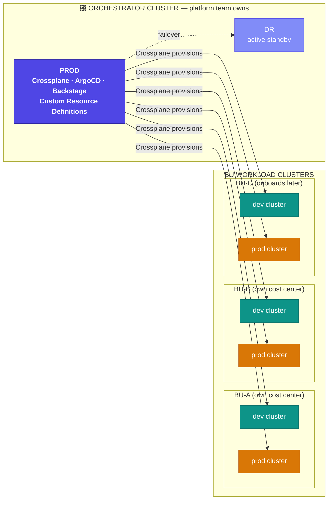
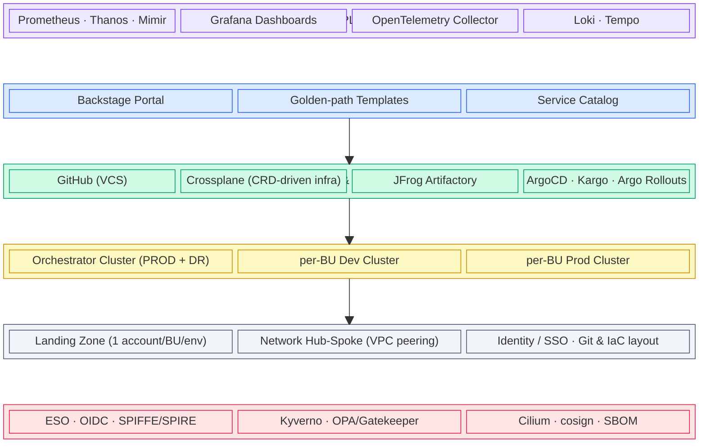
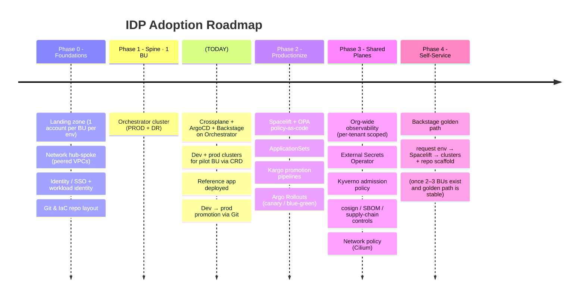

# Internal Developer Platform (IDP)

## What We Are Building

A **greenfield Internal Developer Platform** that gives every Business Unit (BU) a self-service, opinionated way to get production-grade Kubernetes environments — without doing raw infrastructure work.

A BU asks for an environment. The platform provisions it. Everything in between is abstracted behind **golden paths** (paved roads that make the right way the easy way) and **guardrails** (policy enforcement that makes the wrong way impossible).

This is operated by a **central platform team**, centrally funded, with BUs billed only for their own workload clusters (dev + prod). The orchestrator cluster is platform cost.

---

## How It Works


There are two distinct flows in the platform:

### Flow ①: Self-Service Provisioning (once per BU environment)

A BU Admin opens Backstage and fills in an environment request form. They supply:

- AWS Account ID for the **dev** environment
- AWS Account ID for the **prod** environment
- Desired AWS region, node sizing, cost-center tag, and team contacts

Backstage converts this into an **Environment CRD** applied to the Orchestrator Cluster. Crossplane picks up that CRD, assumes a cross-account IAM role into the BU's AWS account, and builds the full environment:

| Resource | Detail |
|---|---|
| VPC | One isolated VPC per environment (dev and prod get separate VPCs in separate accounts) |
| Subnets | 1 public subnet (NAT GW + LB ENIs) · 2 private subnets (EKS worker nodes) |
| EKS Cluster | Self-managed node group · IMDSv2 enforced · EBS encryption enabled |
| IRSA + OIDC | Per-workload IAM roles mapped to Kubernetes service accounts |
| Add-ons | ArgoCD agent · ESO · Cilium CNI — bootstrapped at cluster creation |

The ArgoCD agent installed on the BU cluster registers it with the orchestrator's ArgoCD, enabling remote GitOps management from that point forward. **The orchestrator tracks all provisioned clusters in its CRD store but hosts none of their workloads.**

### Flow ②: Code Delivery (every git push)

Once a BU's clusters are provisioned, their developers work entirely through Git:

1. Developer pushes code to their GitHub repo (tagged as belonging to BU A)
2. GitHub CI runs: builds the image, signs it with cosign, generates an SBOM, pushes to JFrog Artifactory
3. The image tag is bumped in the Git overlay for the dev environment
4. ArgoCD on the orchestrator detects the Git change and reconciles **only BU A's dev cluster** — the Application scoping at provision time enforces isolation; BU B's cluster is never touched
5. Promotion to prod is a Git operation: bump the image tag in the prod overlay (via Kargo pipeline in Phase 2) and ArgoCD reflects it, with Argo Rollouts executing a canary or blue-green rollout

**Key principle: ArgoCD does not "push" code. It continuously reconciles each cluster to whatever Git declares. If a cluster drifts, ArgoCD corrects it automatically.**

---

## Cluster Topology



> Full topology diagram, component breakdown, and DR strategy: [CLUSTER-TOPOLOGY.md](CLUSTER-TOPOLOGY.md)

---

## GitOps Promotion Flow

```mermaid
flowchart LR
    PUSH["👩‍💻 Developer\n━━━━━━━━━━━━\nPushes code"]
    PR["GitHub PR\n━━━━━━━━━━━━\nReview → merge"]
    CI["CI Build\n━━━━━━━━━━━━\nImage built + signed\nSBOM generated\nPushed to JFrog"]
    DEV_GIT["Git update\n━━━━━━━━━━━━\nBump image tag\ndev overlay"]
    DEV_SYNC["ArgoCD\n━━━━━━━━━━━━\nReconciles\ndev cluster ✅"]
    PROMOTE["Promotion\n━━━━━━━━━━━━\nKargo pipeline\nor overlay bump"]
    PROD_GIT["Git update\n━━━━━━━━━━━━\nBump image tag\nprod overlay"]
    PROD_SYNC["ArgoCD\n━━━━━━━━━━━━\nReconciles\nprod cluster\ncanary / blue-green ✅"]

    PUSH --> PR --> CI --> DEV_GIT --> DEV_SYNC --> PROMOTE --> PROD_GIT --> PROD_SYNC

    style PUSH      fill:#1D4ED8,stroke:#1E3A8A,color:#FFFFFF,font-weight:bold
    style PR        fill:#1D4ED8,stroke:#1E3A8A,color:#FFFFFF
    style CI        fill:#7C3AED,stroke:#5B21B6,color:#FFFFFF
    style DEV_GIT   fill:#4F46E5,stroke:#3730A3,color:#FFFFFF
    style DEV_SYNC  fill:#0D9488,stroke:#0F766E,color:#FFFFFF
    style PROMOTE   fill:#D97706,stroke:#B45309,color:#FFFFFF,font-weight:bold
    style PROD_GIT  fill:#4F46E5,stroke:#3730A3,color:#FFFFFF
    style PROD_SYNC fill:#DC2626,stroke:#991B1B,color:#FFFFFF,font-weight:bold
```



> Full flow diagram, stage breakdown, and key principles: [GITOPS-PROMOTION.md](GITOPS-PROMOTION.md)

---

## The Economic Story

```
BU #1 onboards → pays for the spine (foundation + orchestrator cluster + CRD platform)
BU #2 onboards → rides the shared orchestrator, only pays for its own clusters
BU #3 onboards → marginal cost falls further
...
Cost per tenant trends DOWN as adoption grows
```

The orchestrator cluster is a flat tax on the platform team's budget. Every BU after the first rides existing infrastructure — Backstage, Crossplane, and ArgoCD are already running and ready to provision the next tenant on demand.

| Resource | Who pays | Scaling behaviour |
|---|---|---|
| Orchestrator Cluster (PROD + DR) | Platform team — central budget | Flat — does not grow with BU count |
| BU Dev Cluster | BU cost center | Linear — 1 cluster per BU |
| BU Prod Cluster | BU cost center | Linear — 1 cluster per BU |

---

## Five CNCF Platform Planes



> Observability and Security are **cross-cutting** — they span all three core planes.

---

## Phased Roadmap



---

## Toolchain at a Glance

| Plane | Tool | Role |
|---|---|---|
| Developer Control | Backstage | Self-service portal — hosted on Orchestrator Cluster |
| Integration & Delivery | GitHub | VCS, CI |
| Integration & Delivery | Crossplane | CRD-driven infra provisioning (clusters, VPCs, IAM, etc.) |
| Integration & Delivery | JFrog Artifactory | Image & artifact registry |
| Integration & Delivery | ArgoCD | GitOps CD — hosted on Orchestrator Cluster |
| Integration & Delivery | Kargo | Multi-stage promotion pipelines |
| Integration & Delivery | Argo Rollouts | Progressive delivery (canary/blue-green) |
| Resource | Orchestrator Cluster | PROD + DR · runs Crossplane, ArgoCD, Backstage |
| Resource | BU Clusters | per-BU dev + prod · provisioned by Crossplane via CRDs |
| Observability | Prometheus / Thanos | Metrics (per-tenant scoped) |
| Observability | Grafana | Dashboards |
| Observability | OpenTelemetry | Telemetry collection |
| Observability | Loki / Tempo | Logs + traces |
| Security | External Secrets Operator | Secrets from cloud secret manager |
| Security | Kyverno | Admission-enforced policy |
| Security | Cilium | CNI + network policy |
| Security | cosign / sigstore | Image signing |
| Security | SPIFFE/SPIRE | Cross-cluster workload identity |

---

## KPIs

| Category | What to track |
|---|---|
| **Adoption** | BUs onboarded · time-to-first-environment |
| **Outcomes** | DORA: lead time · deploy frequency · change-failure rate · MTTR |
| **Governance** | % workloads behind enforced policy + signed supply chain |
| **Unit economics** | Cost per tenant trending down · spend attributed per cost center |
