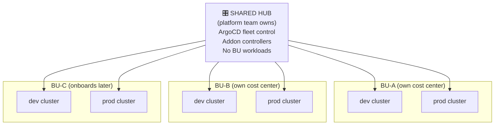
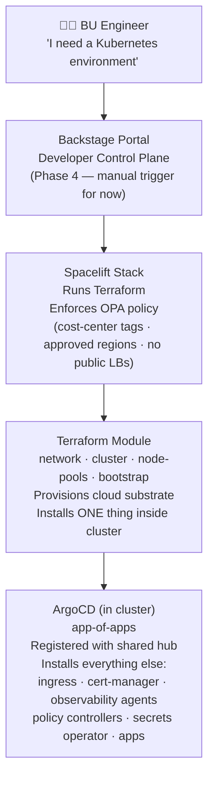
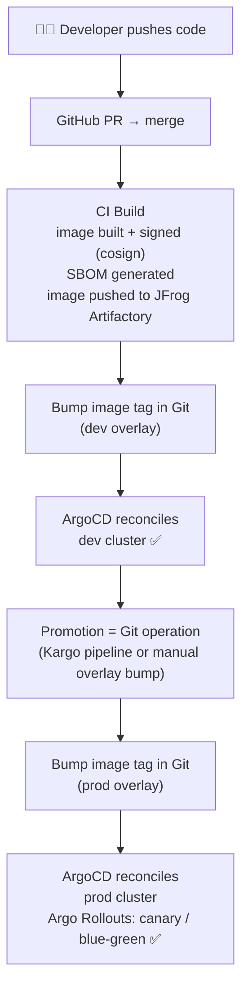
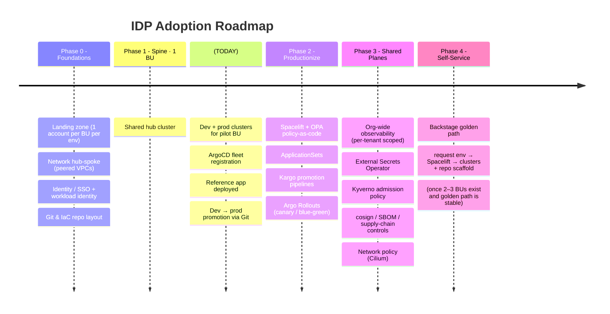

# Internal Developer Platform (IDP)

## What we are building

A **greenfield Internal Developer Platform** that gives every business unit (BU) a self-service, opinionated way to get production-grade Kubernetes environments — without doing raw infrastructure work.

A BU asks for an environment. The platform provisions it. Everything in between is abstracted behind **golden paths** (paved roads that make the right way the easy way) and **guardrails** (policy enforcement that makes the wrong way impossible).

This is operated by a **central platform team**, centrally funded, with BUs billed only for their own workload clusters (dev + prod). The shared hub is platform cost.

---

## The Economic Story

```
BU #1 onboards → pays for the spine (foundation + shared hub + modules)
BU #2 onboards → rides the shared hub, only pays for its own clusters
BU #3 onboards → marginal cost falls further
...
Cost per tenant trends DOWN as adoption grows
```

The shared hub is a flat tax on the platform team's budget. Every BU after the first rides existing infrastructure — the inverse of a model where each new tenant adds a full dedicated hub.

---

## Five CNCF Platform Planes


> Observability and Security are **cross-cutting** — shown as top/bottom bands to reflect that they span all three core planes.

---

## Cluster Topology: Shared Hub ✅

One shared hub (platform team owns) orchestrates per-BU dev and prod clusters. The hub runs no business workload — only ArgoCD fleet control and addon controllers.



| Model | 3 BUs = ? clusters | Cost trend |
| ----- | ------------------ | ---------- |
| **Shared hub** | **7 (1 hub + 6 clusters)** | **Hub is a flat tax — cost per BU falls** |
| Hub-per-BU | 9 (3 hubs + 6 clusters) | Grows linearly with adoption |

---

## How a BU Gets an Environment



**Principle: "Terraform bootstraps, GitOps runs"**

---

## GitOps Promotion Flow



---

## Phased Roadmap



---

## Toolchain at a Glance

| Plane                  | Tool                      | Role                                     |
| ---------------------- | ------------------------- | ---------------------------------------- |
| Developer Control      | Backstage                 | Self-service portal (Phase 4)            |
| Integration & Delivery | GitHub                    | VCS, CI                                  |
| Integration & Delivery | Spacelift                 | IaC execution + OPA policy-as-code       |
| Integration & Delivery | JFrog Artifactory         | Image & artifact registry                |
| Integration & Delivery | ArgoCD                    | GitOps continuous delivery               |
| Integration & Delivery | Kargo                     | Multi-stage promotion pipelines          |
| Integration & Delivery | Argo Rollouts             | Progressive delivery (canary/blue-green) |
| Resource               | Terraform                 | Cluster + network provisioning           |
| Observability          | Prometheus / Thanos       | Metrics (per-tenant scoped)              |
| Observability          | Grafana                   | Dashboards                               |
| Observability          | OpenTelemetry             | Telemetry collection                     |
| Observability          | Loki / Tempo              | Logs + traces                            |
| Security               | External Secrets Operator | Secrets from cloud secret manager        |
| Security               | Kyverno                   | Admission-enforced policy                |
| Security               | Cilium                    | CNI + network policy                     |
| Security               | cosign / sigstore         | Image signing                            |
| Security               | SPIFFE/SPIRE              | Cross-cluster workload identity          |

---

## KPIs

| Category           | What to track                                                    |
| ------------------ | ---------------------------------------------------------------- |
| **Adoption**       | BUs onboarded · time-to-first-environment                        |
| **Outcomes**       | DORA: lead time · deploy frequency · change-failure rate · MTTR  |
| **Governance**     | % workloads behind enforced policy + signed supply chain         |
| **Unit economics** | Cost per tenant trending down · spend attributed per cost center |
