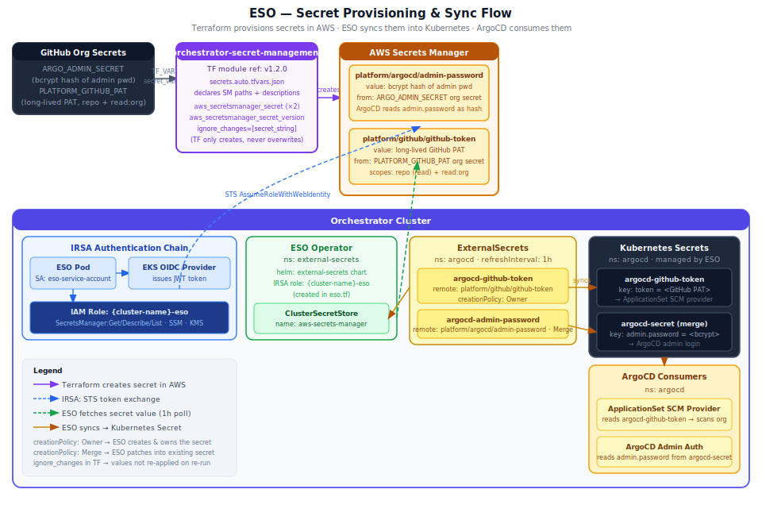

# Secret Management

Platform secrets follow a two-phase lifecycle: **Terraform provisions** them into AWS Secrets Manager once at cluster setup, and **ESO continuously syncs** them into Kubernetes secrets on a one-hour refresh cycle.

---

## Phase 1 — Provisioning (Terraform, runs once)

The `orchestrator-secret-management` stage in `orchestrator-plane-setup` creates the secrets in AWS Secrets Manager. Secret **paths and descriptions** are committed in `secrets.auto.tfvars.json` (safe to commit — no values). Secret **values** are injected at CI runtime from GitHub org secrets as `TF_VAR_secret_values`, scoped to that workflow step only so they never leak to other Terraform stages.

| Logical key | SM path | Value source | Purpose |
|---|---|---|---|
| `argocd_admin` | `platform/argocd/admin-password` | `ARGO_ADMIN_SECRET` org secret | ArgoCD admin login — stored as a **bcrypt hash** (not plaintext) |
| `github_token` | `platform/github/github-token` | `PLATFORM_GITHUB_PAT` org secret | GitHub PAT for ArgoCD SCM provider — needs `repo` (read) + `read:org` scopes |

**Key Terraform behaviour:** `ignore_changes = [secret_string]` is set on every `aws_secretsmanager_secret_version`. This means Terraform creates the initial secret version but never overwrites the value on subsequent runs. Secret rotation is done outside Terraform.

The module is called at `ref=v1.2.0` from `orchestrator-plane-setup/orchestrator-secret-management/`.

---

## Phase 2 — Sync (ESO, ongoing every 1 hour)

Once the orchestrator cluster is running, the External Secrets Operator syncs AWS Secrets Manager values into Kubernetes secrets automatically.

### IRSA Authentication Chain

ESO does not use static AWS credentials. Instead it uses IRSA (IAM Roles for Service Accounts):

1. The ESO pod runs under the `eso-service-account` service account in the `external-secrets` namespace
2. The EKS OIDC provider issues a signed JWT for that service account
3. ESO calls `STS:AssumeRoleWithWebIdentity` with the JWT to obtain temporary AWS credentials
4. STS validates the JWT against the cluster's OIDC provider and returns credentials scoped to the IAM role

The IAM role (`{cluster-name}-eso`) is created by `orchestrator-custom-addons/eso.tf` with the following permissions:

| Permission set | Actions |
|---|---|
| Secrets Manager | `GetSecretValue` · `DescribeSecret` · `ListSecrets` |
| SSM Parameter Store | `GetParameter` · `GetParameters` · `GetParametersByPath` · `DescribeParameters` |
| KMS | `Decrypt` · `DescribeKey` |

### ClusterSecretStore

`eso.tf` also creates a `ClusterSecretStore` named `aws-secrets-manager` — a cluster-wide ESO resource that holds the AWS connection config (region, auth method). All `ExternalSecret` resources reference this store by name rather than embedding AWS config themselves.

### ExternalSecrets → Kubernetes Secrets

Two `ExternalSecret` resources are created by `orchestrator-custom-addons/eso-external-secrets.tf`, both in the `argocd` namespace with `refreshInterval: 1h`:

| ExternalSecret | SM path pulled | Target Kubernetes secret | Key | creationPolicy |
|---|---|---|---|---|
| `argocd-github-token` | `platform/github/github-token` | `argocd-github-token` | `token` | `Owner` — ESO creates and owns this secret |
| `argocd-admin-password` | `platform/argocd/admin-password` | `argocd-secret` | `admin.password` | `Merge` — ESO patches this key into the existing secret ArgoCD creates |

**`creationPolicy: Owner`** — ESO is the sole owner of `argocd-github-token`. If the ExternalSecret is deleted, ESO garbage-collects the Kubernetes secret too.

**`creationPolicy: Merge`** — ArgoCD creates `argocd-secret` itself during startup. ESO patches only the `admin.password` key into it, leaving ArgoCD's other keys (session signing key, etc.) untouched.

---

## Secret Consumers

| Kubernetes secret | Consumer | How it is used |
|---|---|---|
| `argocd-github-token` (key: `token`) | ArgoCD ApplicationSet SCM Provider | Authenticates to the GitHub API to discover repos tagged `platform-custom-xrds` |
| `argocd-secret` (key: `admin.password`) | ArgoCD server | Admin login — ArgoCD expects this as a bcrypt hash, not plaintext |

---

## Adding a New Platform Secret

1. Add an entry to `orchestrator-plane-setup/orchestrator-secret-management/secrets.auto.tfvars.json` with the SM path and description
2. Add the secret value to the appropriate GitHub org secret (or create a new one) and wire it into the `TF_VAR_secret_values` step `env:` in `orchestrator-plane-setup/.github/workflows/main.yml`
3. Run the `orchestrator-secret-management` CI stage to provision the SM secret
4. Add an `ExternalSecret` resource in `orchestrator-custom-addons/eso-external-secrets.tf` pointing at the new SM path and the target Kubernetes secret
5. Release `orchestrator-custom-addons` — ESO will begin syncing the new secret within one refresh cycle
